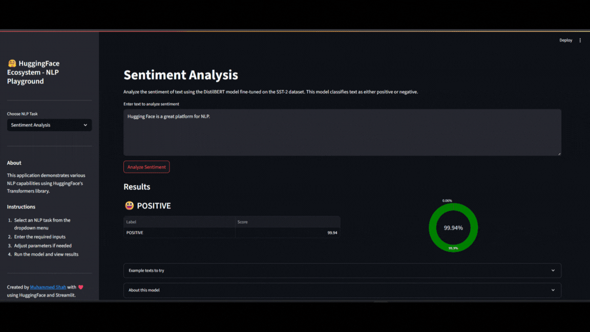

# 🤗 HuggingFace Ecosystem - NLP Playground

A Streamlit-based web application showcasing various NLP capabilities using HuggingFace's Transformers library.

## Features

- **Sentiment Analysis**: Analyze the sentiment of text (positive/negative)
- **Text Summarization**: Generate concise summaries of longer texts
- **Named Entity Recognition**: Identify entities like persons, organizations, and locations
- **Question Answering**: Extract answers to questions from a given context
- **Text Generation**: Create coherent text continuations from a prompt
- **Semantic Search**: Find semantically similar texts using embeddings

## Models Used

- Sentiment Analysis: `distilbert-base-uncased-finetuned-sst-2-english`
- Text Summarization: `facebook/bart-large-cnn`
- Named Entity Recognition: `dslim/bert-base-NER`
- Question Answering: `deepset/roberta-base-squad2`
- Text Generation: `gpt2-medium`
- Semantic Search: `sentence-transformers/all-MiniLM-L6-v2`

## Demo Snapshots

> Note: Installation and setup instructions to run this project locally can be found [here](instructions.md)

&nbsp;

## Message from the author

This app is something I've always wanted to make ever since I came across the HF ecosystem 2 years ago, especially the different NLP capabilities that it offers (now there are more, but i wanted to start with this). I hope to introduce more features into this as I learn more in the future. So yeah, I am super proud of how this turned out. Although I'm sure there might be more similar apps such as this. But its been on my mind for a long time and I'm glad its been built now. There's ofcourse room for improvement, I look forward to change and experiment things as I move forward with this.